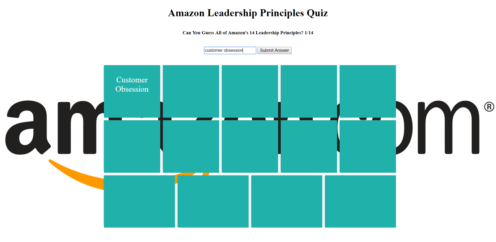

# Amazon Quiz

## Hosted on Github Pages

https://nguyenvinh2.github.io/AmazonQuiz/

## Overview

This is a simple Javascript base application that tests user's knowledge on the 14 Leadership Principles of Amazon.

There web page has 14 containers, each with the individual leadership definitions that appears if the user hovers or clicks on the container.

## Output

